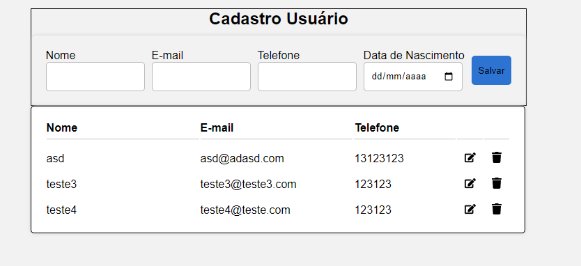

# CRUD Cadastrar Usuário



Este projeto é um aplicativo de cadastro de usuários, construído com Node.js, Express e React. A seguir, explicamos por que escolhemos essas tecnologias para desenvolver este projeto.

## Tecnologias Utilizadas

### Node.js

- **Alta Performance:** Node.js é conhecido por sua alta performance devido à sua arquitetura orientada a eventos e ao uso do V8, o motor JavaScript do Google.
- **Ecossistema Rico:** A vasta quantidade de pacotes disponíveis no npm facilita a integração de diversas funcionalidades de maneira rápida e eficiente.
- **JavaScript em Toda Parte:** Permite que os desenvolvedores usem JavaScript tanto no front-end quanto no back-end, facilitando o desenvolvimento e a manutenção do código.

### Express

- **Simplicidade e Flexibilidade:** Express é um framework minimalista que fornece uma interface robusta para criar APIs e aplicativos web, sem impor muitas restrições.
- **Middleware:** A arquitetura de middleware do Express permite adicionar facilmente funcionalidades ao seu aplicativo, como autenticação, manipulação de cookies, logs e muito mais.
- **Comunidade e Suporte:** Possui uma grande comunidade e excelente suporte, com muita documentação e recursos disponíveis para desenvolvedores.

### React

- **Componentização:** React permite construir interfaces de usuário complexas a partir de componentes isolados e reutilizáveis, facilitando o desenvolvimento e a manutenção do código.
- **Virtual DOM:** O uso do Virtual DOM melhora significativamente a performance das aplicações ao minimizar os custos de manipulação do DOM real.
- **Popularidade e Comunidade:** É uma das bibliotecas front-end mais populares, com uma vasta comunidade e muitos recursos disponíveis, incluindo bibliotecas e ferramentas complementares.

## Como Executar o Projeto

### Pré-requisitos

- Node.js instalado
- npm (gerenciador de pacotes do Node.js)
- MySQL (ou outro banco de dados compatível)

### Passos para Configuração

1. Clone o repositório:
   ```sh
   git clone https://github.com/seu-usuario/crud-cadastrar-usuario.git
   cd crud
2. Instale as dependências do back-end:
    ```sh
    cd api
    npm install
3. Instale as dependências do front-end:
   ```sh
   cd ../frontend
   npm install
4. Configure o arquivo .env no diretório backend com suas variáveis de ambiente:
  ```env
  DB_PASSWORD=sua-senha
  DB_DATABASE=crud
```
5. Inicie o servidor back-end:
  ```sh
  cd ../api
  npm start
```
6. Inicie o front-end:
  ```sh
  cd ../frontend
  npm start
```
### Contribuição
Contribuições são bem-vindas! Sinta-se à vontade para abrir issues e pull requests para melhorar este projeto.
